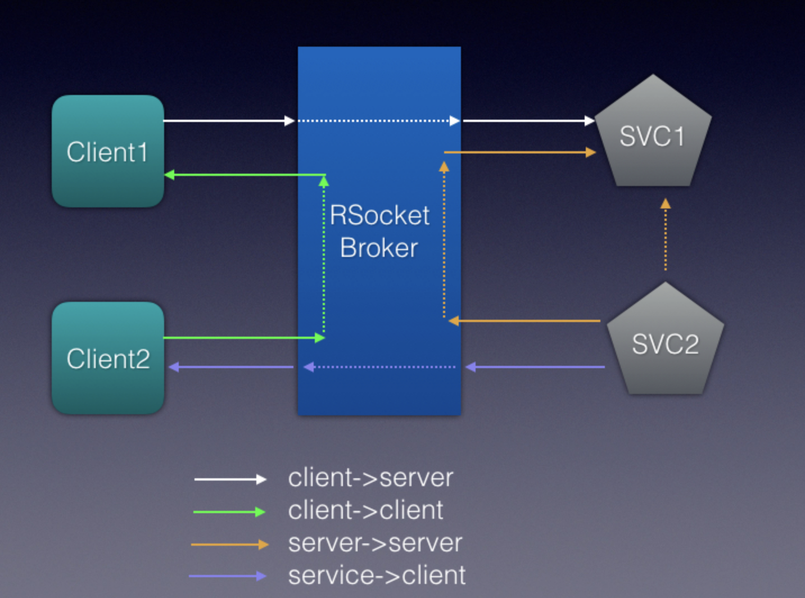

# RSocke broker demo

## Introduction
Some time ago, I showed another [demo](https://github.com/szihai/broker-flat) about one of the broker use cases. In this demo, we'll examine what's in the broker. Of course this is a prototype. However it should be good enough to illustrate the features of the broker.

## What's different about RSocket
Other technologies use broker as well. For example, Kafka requires the broker deployment model. So, how is RSocket broker different from the others?   
First, RSocket doesn't mandate the broker model. It is for the simplicity of devop tasks.  
The current microservices orchastration tools make the networking unnecessarily complicated for the devleopers. The developers should not worry about which ip or which port to use. All they care about is the application level networking: service A talks to service B. For point to point connections, the burden is on the developers to figure out the IP and port. If, however, we let devops take care of the brokers and application will only need to connect to a known IP:port, things will be much easier. The broker not only shields the networking complecity from the developers, but it also provides a place outside of the applications to add policies or controls or logging features. I would say it enables the combination of control plane and data plane which provides similar functionality as service mesh.

all endpoints connect to the broker.  Both the service and the consumer are clients to the broker. The only difference is a service has to register itself to the broker.

